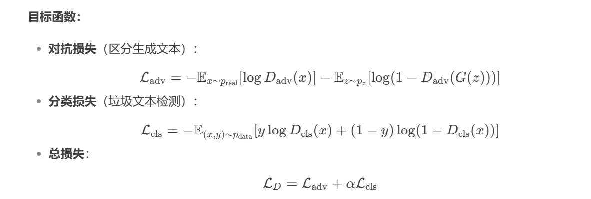

# **基于GAN的垃圾文本检测**

## **核心思想**：

为了解决中文文本的垃圾文本检测问题（这里的垃圾文本的定义主要是同音或同形字词替换，以绕过敏感词审查的文本），基于已有的训练pipeline改进，引入GAN网络（如果用某种办法能得到更多训练样本的话性能自然应该提升，而事实上这个任务是一个二分类，我们需要得到的其实就是更多的负样本，那很自然想到可以使用GAN），分别训练生成器和判别器两个模型，利用生成器自动生成逼真的对抗性垃圾文本（如变形词、同音字替换）扩充训练数据，通过判别器区分真实样本与生成样本，提升模型鲁棒性。

## 训练pipeline：

已有的训练pipeline：这是原论文Adversarial Spam Detector With Character Similarity Network的pipeline，也是课上讲的实战的内容，这里的字符相似性网络从字形、字音两个角度分别判断相似度，然后通过word2vec和自注意力层得到embedding，最后做分类

**基于GAN的训练pipeline：**一般的GAN的生成器的目标应该是去生成以假乱真的样本，然后判别器去判别假样本和真样本。这里有所不同，生成器用正常样本分别去生成更多负样本（垃圾样本），其目标是让判别器分辨不出正样本和负样本，不管这个负样本是生成的还是真实数据；而判别器的目标是区分正负样本。事实上，已有的pipeline可以完全直接作为判别器的pipeline。

另外原有的pipeline有一些细节可以优化，比如相似度阈值可以设为动态的

## 具体实现细节：

1. **生成器**：

   - 输入：正常文本或种子垃圾文本。

   - 方法：结合字符相似性网络（CSN），按字形/字音相似性生成变体词（如“微信→维信、胃星”）。

   - 模型：使用LSTM或Transformer生成连贯的对抗文本。也可以调用预训练模型。

   - 目标函数（仅供参考思想，具体待议）：为了最大化判别器损失

     

2. **判别器设计**：

   - 输入：真实垃圾文本 + 生成器输出的对抗文本。
   - 目标：区分真实垃圾文本与生成文本，同时完成正常/垃圾文本的二分类。
   - 架构：在现有分类模型（如SVM、LSTM）基础上增加对抗分支。
   - 目标函数（仅供参考思想，具体待议）：
   - 

3. **对抗训练流程**：

   - 生成器生成对抗样本 → 判别器同时学习分类和对抗检测 → 反馈梯度优化生成器生成更难辨别的样本。

**优势**：

- 自动生成多样化的对抗样本。
- 提升模型对新型变形词、同音替换的检测能力，提高鲁棒性。

## 更多的优化想法：

对判别器做对比学习，进一步通过对比学习优化embedding，使同类样本（垃圾或正常文本）的特征更紧密，不同类样本的特征更分散。