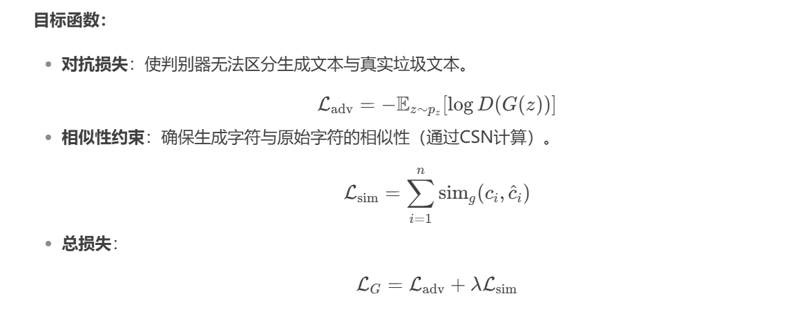

# **基于GAN的垃圾文本检测**

## **核心思想**：

为了解决中文文本的垃圾文本检测问题（这里的垃圾文本的定义主要是同音或同形字词替换，以绕过敏感词审查的文本），基于已有的训练pipeline改进，引入GAN网络（如果用某种办法能得到更多训练样本的话性能自然应该提升，而事实上这个任务是一个二分类，我们需要得到的其实就是更多的负样本，那很自然想到可以使用GAN），分别训练生成器和判别器两个模型，利用生成器自动生成逼真的对抗性垃圾文本（如变形词、同音字替换）扩充训练数据，通过判别器区分真实样本与生成样本，提升模型鲁棒性。

## 训练pipeline：

已有的训练pipeline：这是原论文Adversarial Spam Detector With Character Similarity Network的pipeline，也是课上讲的实战的内容，这里的字符相似性网络从字形、字音两个角度分别判断相似度，然后通过word2vec和自注意力层得到embedding，最后做分类

**基于GAN的训练pipeline：**一般的GAN的生成器的目标应该是去生成以假乱真的样本，然后判别器去判别假样本和真样本。这里有所不同，生成器用正常样本分别去生成更多负样本（垃圾样本），其目标是让判别器分辨不出正样本和负样本，不管这个负样本是生成的还是真实数据；而判别器的目标是区分正负样本。事实上，已有的pipeline可以完全直接作为判别器的pipeline。

另外原有的pipeline有一些细节可以优化，比如相似度阈值可以设为动态的

## 具体实现细节：

1. **生成器**：

   - 输入：正常文本或种子垃圾文本。

   - 方法：结合字符相似性网络（CSN），按字形/字音相似性生成变体词（如“微信→维信、胃星”）。

   - 模型：使用LSTM或Transformer生成连贯的对抗文本。也可以调用预训练模型。

   - 目标函数（仅供参考思想，具体待议）：为了最大化判别器损失

     

2. **判别器设计**：

   ### 判别器设计核心思想

判别器承担着双重任务：
1. 准确区分正常文本与垃圾文本（二分类任务）
2. 识别生成器产生的"伪装"垃圾文本

为了提高模型的鲁棒性和检测能力，设计了一个结合已有pipeline的增强型判别器架构。

### 判别器架构详解

判别器将在原有的字符相似性网络基础上进行扩展，主要包含以下组件：

1. **字符相似性特征提取层**
   - 保留原有pipeline中的字形相似度和字音相似度网络
   - 对每个字符进行相似性分析，捕获同音字和形近字替换特征

2. **Word2Vec与自注意力层**
   - 利用Word2Vec捕获词汇语义信息
   - 自注意力机制关注上下文关系，理解替换词在句子中的不协调性

3. **特征融合与增强模块**
   - 融合字符级特征和语义级特征
   - 引入残差连接，保留原始信息流
   - 设计特征增强层，突出关键检测点

4. **对抗判别与分类分支**
   - **正常/垃圾分类任务**：保持原有的二分类功能
   - **真实/生成判别任务**：新增分支，区分真实垃圾文本与生成器产生的文本

### 判别器损失函数设计

判别器的总损失由两部分组成：

$$
L_D = \lambda_1 \cdot L_{classification} + \lambda_2 \cdot L_{adversarial}
$$

其中:
- $L_{classification} = \text{CrossEntropy}(y_{pred}, y_{true})$  # 正常/垃圾文本分类损失
- $L_{adversarial} = \text{BCE}(d_{pred}, d_{true})$  # 真实/生成文本判别损失
- $\lambda_1$, $\lambda_2$ 为平衡两种任务的权重参数

### 判别器训练策略

- **多阶段训练**：
  1. 首先在真实数据上预训练判别器，学习基本的垃圾文本特征
  2. 引入生成器产生的样本，开始对抗训练
  3. 交替训练生成器和判别器，维持平衡

- **差异化采样**：
  - 构建平衡的训练批次：真实正常文本、真实垃圾文本、生成的伪垃圾文本
  - 动态调整各类样本比例，防止判别器过度偏向某一类

- **梯度惩罚机制**：
  - 引入Wasserstein距离与梯度惩罚，提高GAN训练稳定性
  - 减少模式崩溃风险
  - 
3. **对抗训练流程**：

   - 生成器生成对抗样本 → 判别器同时学习分类和对抗检测 → 反馈梯度优化生成器生成更难辨别的样本。

**优势**：

- 自动生成多样化的对抗样本。
- 提升模型对新型变形词、同音替换的检测能力，提高鲁棒性。

## 更多的优化想法：

对判别器做对比学习，进一步通过对比学习优化embedding，使同类样本（垃圾或正常文本）的特征更紧密，不同类样本的特征更分散。
