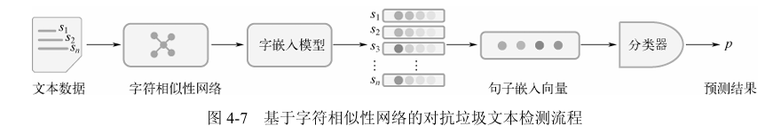
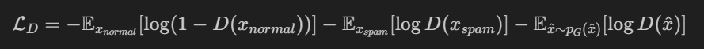

# **基于GAN的垃圾文本检测**

## **核心思想**：

为了解决中文文本的垃圾文本检测问题（这里的垃圾文本的定义主要是同音或同形字词替换，以绕过敏感词审查的文本），基于已有的训练pipeline改进，引入GAN网络（如果用某种办法能得到更多训练样本的话性能自然应该提升，而事实上这个任务是一个二分类，我们需要得到的其实就是更多的负样本，那很自然想到可以使用GAN），分别训练生成器和判别器两个模型，利用生成器自动生成逼真的对抗性垃圾文本（如变形词、同音字替换）扩充训练数据，通过判别器区分真实样本与生成样本，提升模型鲁棒性。

## 训练pipeline：

已有的训练pipeline：这是原论文Adversarial Spam Detector With Character Similarity Network的pipeline，也是课上讲的实战的内容，这里的字符相似性网络从字形、字音两个角度分别判断相似度，然后通过word2vec和自注意力层得到embedding，最后做分类

**基于GAN的训练pipeline：**一般的GAN的生成器的目标应该是去生成以假乱真的样本，然后判别器去判别假样本和真样本。这里有所不同，生成器用正常样本分别去生成更多负样本（垃圾样本），其目标是让判别器分辨不出正样本和负样本，不管这个负样本是生成的还是真实数据；而判别器的目标是区分正负样本。事实上，已有的pipeline可以完全直接作为判别器的pipeline。

另外原有的pipeline有一些细节可以优化，比如相似度阈值可以设为动态的

## 具体实现细节：

## 生成器

### **构建一个可训练的生成器模型** ，其目标是：

> 1. **生成具有“正常语义”的伪垃圾文本** （通过同音词替换）
> 2. **最大程度骗过判别器模型（即垃圾文本识别器）**
> 3. 同时尽可能**保持与原始文本的语义/形式相似度**

| 方案                                            | 描述                                                                 | 优点                                 | 难点                     |
| ----------------------------------------------- | -------------------------------------------------------------------- | ------------------------------------ | ------------------------ |
| **1. REINFORCE 式 TextGAN** (校友的项目)  | 用策略梯度训练生成器                                                 | GAN思想保留、目标明确                | 不稳定，训练难收敛       |
| **2. Gumbel-Softmax + 同音替换生成器**    | 用可微近似离散替换进行训练                                           | 端到端可微，兼容同音词表             | 实现复杂，替换需嵌入网络 |
| **3. Encoder-Decoder + 控制替换 Mask**    | 用 Transformer 在 Mask 位置控制替换                                  | 可控性强，可训练                     | 需标注哪些词能换         |
| **4. 检测器-guided 替换优化器（最推荐）** | 用规则生成初始样本 → 训练一个替换策略（生成器）以最大化判别器误判率 | 易于实现、可迭代优化、符合你现有资源 | 需精细控制生成器目标函数 |

### 目标：

* **G（生成器）** ：学习一个替换策略 $\pi_\theta(w_i \rightarrow \hat{w}_i)$，在给定原始句子和替换词表的前提下，生成一个**伪垃圾文本** $\hat{x}$；
* **D（判别器）** ：已有的垃圾文本检测模型（可冻结或同步训练）；
* **Loss 目标** ：

$$
\mathcal{L}_G = \alpha \cdot \underbrace{\text{CE}(D(\hat{x}), \text{normal})}_{\text{欺骗判别器}} + \beta \cdot \underbrace{1 - \text{Sim}(\hat{x}, x)}_{\text{与原文相似度惩罚}}
$$

---

### 训练流程（GAN-style）：

1. **输入** ：原始正常句子 x，同音词表；
2. **生成器 G** ：对部分词位替换成同音词，输出扰动文本 $\hat{x}$；
3. **判别器 D** ：对 $\hat{x}$ 判断是否是垃圾；
4. **优化 G** ：

* 如果 D 认为它是正常的 → G 成功；
* 若 D 识别出是垃圾 → G 尝试修改替换策略；

反向传播 G 的 loss，最大化其“欺骗成功率 + 句子相似性”。

### 实现：

* G 可以是一个  **Mask-then-predict 模型** （如 BERT-style），在词位上决策“是否替换 + 替换哪一个候选”；
* 替换操作用 **Gumbel-Softmax** 或 **REINFORCE** 做；
* 判别器 D 可以是你现有的垃圾检测模型（BERT/GRU + 分类器）；
* 使用 REINFORCE 优化 G，reward 为：

$$
r = \lambda \cdot (1 - D(\hat)) + (1 - \text(x, \hat))
$$

## 判别器

判别器（D）负责区分真实正常文本、真实垃圾文本和生成器（G）产出的伪垃圾文本。将现有的**Adversarial Spam Detector With Character Similarity Network**的Pipeline直接作为判别器的基础。

### 2.1 输入与目标

* **输入**:
   * **真实正常文本** ($x_{normal}$): 标记为"正常"（0）。
   * **真实垃圾文本** ($x_{spam}$): 标记为"垃圾"（1）。
   * **生成垃圾文本** ($\hat{x}$): 由生成器生成的文本，在判别器训练时也标记为"垃圾"（1）。
* **目标**:
   * **二分类**: 准确地将输入文本分类为"正常"或"垃圾"。
   * **对抗性学习**: 有效地识别生成器生成的伪垃圾文本，并为其提供梯度信号，帮助生成器提升生成质量。

### 2.2 架构选择

判别器架构将沿用现有Pipeline的组件，这些组件共同协作，从不同维度捕获文本特征：

* **字符相似性网络**: 用于捕捉文本中的字形、字音相似度特征，这对于识别同音或同形字词替换至关重要。
* **Word2Vec/预训练Embedding**: 将词汇转换为稠密的向量表示，从而捕获词汇的语义信息。
* **自注意力层/Transformer Encoder**: 进一步处理词嵌入，捕获文本中的长距离依赖关系和重要的语义特征。
* **分类层**: 通常是一个全连接层（或多层感知机），最终将提取到的特征映射到二分类的概率输出（正常/垃圾）。

### 2.3 目标函数

判别器训练的目标是最小化其损失函数 $\mathcal{L}_D$，使其能够准确区分不同类别的文本。这里的 $D(x)$ 表示判别器判断输入 $x$ 为"垃圾"的概率。

$$
\mathcal{L}_D = -\mathbb{E}_{x_{normal}}{\log(1 - D(x_{normal}))} - \mathbb{E}_{x_{spam}}{\log D(x_{spam})} - \mathbb{E}_{\hat{x} \sim p_G(\hat{x})}{\log D(\hat{x})}
$$

* **第一项**: 针对**真实正常文本** ($x_{normal}$)。判别器应该将其判断为"正常"，因此希望 $D(x_{normal})$ 接近 0，即 $\log(1 - D(x_{normal}))$ 接近 0。
* **第二项**: 针对**真实垃圾文本** ($x_{spam}$)。判别器应该将其判断为"垃圾"，因此希望 $D(x_{spam})$ 接近 1，即 $\log D(x_{spam})$ 接近 0。
* **第三项**: 针对**生成垃圾文本** ($\hat{x}$)。判别器也应该将其判断为"垃圾"，因此希望 $D(\hat{x})$ 接近 1，即 $\log D(\hat{x})$ 接近 0。

这三项共同构成了判别器的交叉熵损失，使其在训练过程中能够学习识别所有形式的垃圾文本（无论是真实的还是生成器伪造的）并将其与正常文本区分开来。

#### 2.4 训练细节

* **数据标记**: 在训练判别器时，真实正常文本标签为0，真实垃圾文本和生成器生成的垃圾文本都标签为1。
* **参数更新**: 判别器在训练生成器阶段会接收到来自生成样本的梯度信息，以学习如何更好地识别这些对抗性样本。
* **初始化与同步**: 判别器可以基于现有的垃圾文本检测模型进行预训练，或者从头开始训练。在GAN的对抗训练过程中，生成器和判别器需要交替更新，以达到一个动态平衡。

## **对抗训练流程**：

   - 生成器生成对抗样本 → 判别器同时学习分类和对抗检测 → 反馈梯度优化生成器生成更难辨别的样本。

**优势**：

- 自动生成多样化的对抗样本。
- 提升模型对新型变形词、同音替换的检测能力，提高鲁棒性。

## 更多的优化想法：

对判别器做对比学习，进一步通过对比学习优化embedding，使同类样本（垃圾或正常文本）的特征更紧密，不同类样本的特征更分散。
